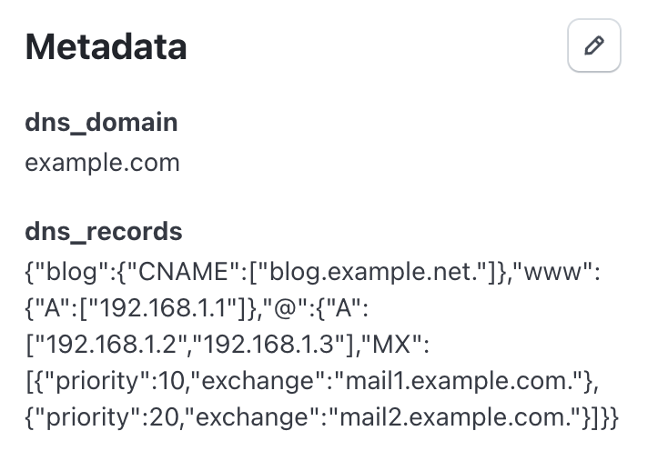

# Introducing MetadNS

_When Good APIs Meet Bad Ideas_

I've always believed the best way to really understand a technology is to push it in stupid, impractical directions and see what breaks. Inspired by Corey Quinn's claim that [Amazon Route 53 is actually a database](https://www.lastweekinaws.com/blog/route-53-amazons-premier-database/), I wondered: what's the opposite of that? If DNS can be used as a database, what's the most absurd way to implement a DNS server?

That thought led me to this project - using [Stripe metadata](https://docs.stripe.com/metadata) as the datastore for a fully functional DNS server.


## Metadata
When working with Stripe, [Metadata](https://docs.stripe.com/metadata) is a really important concept. It greatly simplifies linking Stripe's data model to your own application. Order ids, loyalty programme membership, referral scheme ids - Stripe doesn't know or care what these concepts in your application are, but allows us to store the info on core Stripe objects to simplify linking the two systems together.

You can use it to tag a customer with an internal ID:

```
"internal_user_id": "abcd1234"
```

Or track who triggered a refund:

```
"refunded_by": "support_team_bot"
```

Ultimately metadata is a simple key-value store where you can store arbitrary values on core Stripe objects. Customers, Subscriptions, Payment Intents, Products, etc - all the core Stripe objects have a `metadata` field, in which you can store up to 50 key-value pairs on each object. While Stripe metadata is just a key-value store, with some clever flattening and serialising, it can be coerced into storing structured DNS records - if you're willing to abuse a few best practices along the way.

DNS records are essentially a mapping of record -> location, which sounds an awful lot like something suitable for key-value mapping.

## DNS records
When working with DNS, you'll typically have records like the below:

| Type | Name | Content | Preference |
| ------ | ----- | ------ | ----- |
| A | @ | 192.168.1.2 | |
| A | www | 192.168.1.3 | |
| MX | @ | mail01.google.com | 10 |
| CNAME | blog | blog.wordpress.com. | |

Our first problem with mapping this to Stripe's metadata is that we've got more than just a simple key-value relationship here, with 3-4 properties per line. We could perhaps try to structure it using a delimiter in the value, perhaps something like:

```
metadata: {
    'blog': [
        'CNAME_blog.wordpress.com.'
    ],
    '@': [
        'A_192.168.1.2',
        'MX_mail01.google.com_10'
    ],
    'www': [
        'A_192.168.1.3'
    ],
}
```

It's a bit of a hacky structure, but maybe just about workable? Each key has an array, containing all the records for that Name entry. This is where we hit our next problem - **Stripe metadata is flat**. You can't nest structures or store arrays natively. Every value must be a string.

That limitation doesn't exactly stop you from storing structured data, it just means you've to flatten it yourself first. And then re-expand it on retrieval. It means things like the metadata filter in Stripe's dashboard work less well, but for the purpose of an API-driven integration, it's possible to cram structured data in here. "Supported, if not encouraged", as the saying goes!

```
metadata.dns_records: '{"blog":{"CNAME":["blog.example.net."]},"www":{"A":["192.168.1.3"]},"@":{"A":["192.168.1.2"],"MX":[{"priority":10,"exchange":"mail1.example.com."}]}}'
```

Serialising the data into the key means we can store all our DNS records under one key. Stripe has a limit of [500 characters](https://support.stripe.com/questions/metadata-limits) for metadata values. If you've got a lot of records, you'll probably want to split the `dns_records` key into something like `dns_records_A`, `dns_records_MX`, etc. But then if you've got a lot of DNS records to worry about, chances are you're not going to be running your DNS service using Stripe metadata in the background, so hopefully a moot concern there!


## Storing the data in Stripe
Within Stripe we can create Customer records, without necessarily having to attach credit cards or any real-world payment data. Perfect for this scenario, where we're effectively using Stripe as a free database!

```
const customer = await stripe.customers.create({
  name: 'DNS records for example.com',
  email: 'dns@example.com',
  metadata: {
    dns_domain: 'example.com',
    dns_records: '{"blog":{"CNAME":["blog.example.net."]},"www":{"A":["192.168.1.3"]},"@":{"A":["192.168.1.2"],"MX":[{"priority":10,"exchange":"mail1.example.com."}]}}'
  }
});
```

For clarity, we're using the `email` field purely as a searchable identifier - there's no actual email being sent here.

## Extracting the data from Stripe
When using the Stripe API, there is a [Search API](https://docs.stripe.com/search) which allows us to search on metadata attached to key objects like Customers, PaymentIntents, Products, and so on.

```
const customers = await stripe.customers.search({
  query: "metadata['dns_domain']:'example.com'"
});
```

However, there's a potential weakness here. Stripe's search API runs from a data source which is synced roughly every minute or so. This can mean that if we create an entry then try to search for it immediately afterwards, it may not exist yet in the search index. In the [documentation](https://docs.stripe.com/search#data-freshness), Stripe explicitly warns against using the Search API in read-after-write flows like this:

```
Don't use search for read-after-write flows (for example, searching immediately after a charge is made) because the data won't be immediately available to search. Under normal operating conditions, data is searchable in under 1 minute. Propagation of new or updated data could be delayed during an outage.
```

While Stripe supports metadata-based search, the Search API is eventually consistent - meaning your new records might not show up for up to a minute. That's generally fine for dashboards, but terrible for DNS.

Instead what we will do is use the root domain as the `email` property on the customer record. This allows us to use the `email` filter on the main Customer list API, which does support read-after-write flows:

```
const customers = await stripe.customers.list({
  email: 'dns@example.com'
});
```

When we get the customer record, we parse the metadata, extract the records we've been asked for, then send these records back in response to our query.


## Installation

`npm install`
`cp .env.example .env`
Update the `STRIPE_SECRET_KEY=` value with the secret key from your [Stripe dashboard](https://dashboard.stripe.com/apikeys).


## Creating and updating DNS records

The script `dns-update.js` will attempt to either create a new record, or update an existing one.

Usage:
```
node dns-update.js <domain> <subdomain> <recordType> <value>
```

Examples:
```
node dns-update.js example.com www A 192.168.1.1
node dns-update.js example.com @ A 192.168.1.2,192.168.1.3
node dns-update.js example.com blog CNAME blog.example.net.
node dns-update.js example.com @ MX "10 mail1.example.com.,20 mail2.example.com."
```




## Running the server

`node server.js`

By default this will create a server listening on port `5333` locally (`0.0.0.0`). These settings can be updated in the constructor of the server:
```
constructor(options = {}) {
  this.stripeClient = options.stripeClient || stripe;
  this.port = options.port || 5333;
  this.address = options.address || '0.0.0.0';
  this.server = this._createServer();
}
```


## Querying the DNS Server

```
> dig @127.0.0.1 -p 5333 example.com
;; QUESTION SECTION:
;example.com.			IN	A

;; ANSWER SECTION:
example.com.		300	IN	A	192.168.1.2
example.com.		300	IN	A	192.168.1.3
```

```
> dig @127.0.0.1 -p 5333 example.com MX

;; QUESTION SECTION:
;example.com.			IN	MX

;; ANSWER SECTION:
example.com.		300	IN	MX	10 mail1.example.com.
example.com.		300	IN	MX	20 mail2.example.com.
```

## Limitations

* Metadata string can't be longer than 500 characters. If we need more than this, we would have to do something like split our records over multiple metadata keys - maybe all the records for each sub domain get their own key.
* This is slow. Stripe API calls are generally quite fast as APIs go, but for DNS servers ultra-fast response times are key. There's also no concept of caching here - all responses come back with the same TTL.

There are doubtless plenty more limitations - this is a joke project, without proper error handling or testing. If you even considered running this in production, you are a danger to yourself and others. But if you're experimenting with key-value storage, APIs, or just want to learn how far you can push a flat storage model — this project's for you!

## What exactly is the point of all of this?
This project is definitely not production-grade (please don't...), but it does show:
* How Stripe metadata can be twisted into storing structured data.
* The limits of flat key-value storage, and how to work around them.
* The importance of understanding API consistency models (Search vs List).
* That "bad ideas" are often the best teaching tools.

For a bit more on the background of this project, see the blog post [Introducing MetadNS: When Good APIs Meet Bad Ideas]([https://www.conroyp.com/articles/introducing-metadns-stripe-dns-metadata-bad-ideas-meet-good-apis](https://www.conroyp.com/articles/stripe-dns-provider-metadata-bad-ideas-meet-good-apis)).
